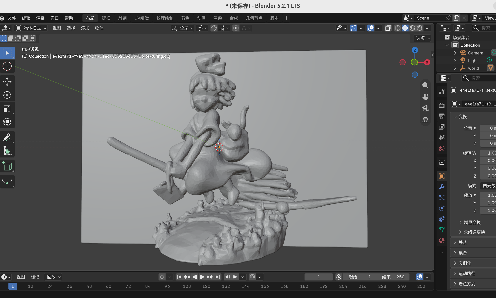
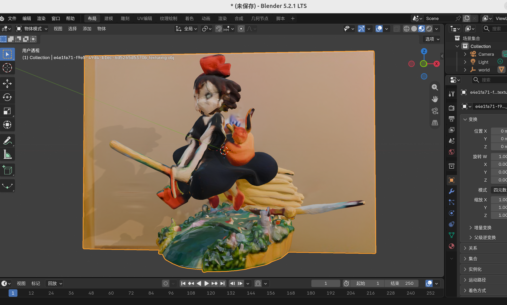

# Hunyuan3D-2.1 API Server

基于 Hunyuan3D-2.1 的 3D 生成 API 服务。

本项目是基于官方Hunyuan3D-2.1 代码在aimax395显卡上作的是配

我适配的显卡是128G的.但是材质部分需要非常高的显存
我在材质生成的时候降低了参数,但是128的显存也是勉强生成,不然会爆显存,导致只生成白模.
我使用的参数是,已经很低了
```
  - max_num_view = 4
  - resolution = 384
  - render_size = 1024
  - texture_size = 1024
```
但是生成出来的模型很差.


白模型可以正常生成.

效果在本文最后

## 启动方法
1 clone本项目作为模型的推理web服务
2 clone模型权重项目
3 创建conda环境,安装本服务里面的requirements.txt
      如果出现库版本的问题请参考我给出我环境的库版本,让AI帮忙解决

## 显卡信息

| 项目 | 详情 |
|------|------|
| 显卡型号 | AMD Radeon Graphics (aimax395) |
| 设备 ID | 0x1586 |
| GFX 架构 | gfx1151 (RDNA 3) |
| 显存大小 | 96 GB (PyTorch 识别) / ~96 GB (ROCm VRAM) |
| 计算单元 | 20 CU |
| 计算能力 | 11.5 |
| ROCm 版本 | 7.2.0 |
| PyTorch 版本 | 2.9.1 + rocm7.2.0 |
| 驱动 | amdgpu |

> 注：rocm-smi 报告 VRAM 约 96 GB（`103079215104 bytes`），实际为 aimax395 128GB 显存版本。

## 启动命令

```bash
conda activate hunyuan3d
python api_server.py --model_path "模型项目的路径"
```


## 使用方法

python3 generate_3d_demo.py  /home/你的图片的路径/1280X1280.PNG


## Conda 环境依赖 (hunyuan3d)

| 包名 | 版本 |
|------|------|
| accelerate | 1.1.1 |
| addict | 2.4.0 |
| aiofiles | 24.1.0 |
| aiohappyeyeballs | 2.7.1 |
| aiohttp | 3.14.3 |
| aiosignal | 1.4.0 |
| annotated-doc | 0.0.5 |
| annotated-types | 0.8.0 |
| antlr4-python3-runtime | 4.9.3 |
| anyio | 4.14.2 |
| asttokens | 3.0.2 |
| attrs | 26.1.0 |
| basicsr | 1.4.2 |
| blinker | 1.9.0 |
| certifi | 2026.7.22 |
| charset-normalizer | 3.5.1 |
| click | 8.5.0 |
| cloudpickle | 3.1.2 |
| coloredlogs | 15.0.1 |
| comm | 0.2.3 |
| ConfigArgParse | 1.7 |
| contourpy | 1.3.3 |
| cycler | 0.12.1 |
| dash | 4.4.1 |
| dataclasses-json | 0.6.7 |
| deepspeed | 0.19.6 |
| Deprecated | 1.3.1 |
| diffusers | 0.30.0 |
| diskcache | 5.6.3 |
| einops | 0.8.0 |
| executing | 2.2.1 |
| facexlib | 0.3.0 |
| fastapi | 0.115.12 |
| fastjsonschema | 2.22.2 |
| ffmpy | 1.0.0 |
| filelock | 3.25.0 |
| filterpy | 1.4.5 |
| Flask | 3.1.3 |
| flatbuffers | 25.12.19 |
| fonttools | 4.64.0 |
| frozenlist | 1.8.0 |
| fsspec | 2026.2.0 |
| future | 1.0.0 |
| gradio | 5.33.0 |
| gradio_client | 1.10.2 |
| groovy | 0.1.2 |
| h11 | 0.16.0 |
| hjson | 3.1.0 |
| httpcore | 1.0.9 |
| httpx | 0.28.1 |
| huggingface-hub | 0.30.2 |
| humanfriendly | 10.0 |
| idna | 3.19 |
| imageio | 2.36.0 |
| importlib_metadata | 9.0.1 |
| ipydatawidgets | 4.3.5 |
| ipython | 9.17.1 |
| ipython_pygments_lexers | 1.1.1 |
| ipywidgets | 8.1.9 |
| itsdangerous | 2.2.0 |
| janus | 2.0.0 |
| jedi | 0.20.0 |
| Jinja2 | 3.1.6 |
| joblib | 1.6.0 |
| jsonschema | 4.26.0 |
| jsonschema-specifications | 2025.9.1 |
| jupyter_core | 5.9.1 |
| jupyterlab_widgets | 3.0.17 |
| kiwisolver | 1.5.1 |
| lazy-loader | 0.5 |
| lightning-utilities | 0.15.3 |
| llama_cpp_python | 0.3.34 |
| llvmlite | 0.49.0 |
| lmdb | 2.3.0 |
| markdown-it-py | 4.2.0 |
| MarkupSafe | 3.0.3 |
| marshmallow | 3.26.2 |
| matplotlib | 3.11.1 |
| matplotlib-inline | 0.2.2 |
| mdurl | 0.1.2 |
| mpmath | 1.3.0 |
| msgpack | 1.2.2 |
| multidict | 6.7.1 |
| mypy_extensions | 1.1.0 |
| narwhals | 2.25.0 |
| nbformat | 5.11.1 |
| nest-asyncio | 1.6.0 |
| networkx | 3.6.1 |
| ninja | 1.11.1.1 |
| numba | 0.67.0 |
| numpy | 1.26.4 |
| omegaconf | 2.3.0 |
| onnxruntime | 1.19.2 |
| open3d | 0.19.0 |
| opencv-python | 4.10.0.84 |
| opencv-python-headless | 4.10.0.84 |
| orjson | 3.12.0 |
| packaging | 26.1 |
| pandas | 2.2.2 |
| parso | 0.8.7 |
| pexpect | 4.9.0 |
| pillow | 11.3.0 |
| pip | 26.1.2 |
| platformdirs | 4.11.7 |
| plotly | 7.0.0 |
| pooch | 1.9.0 |
| prompt_toolkit | 3.0.53 |
| propcache | 0.5.2 |
| protobuf | 7.36.1 |
| psutil | 7.2.2 |
| ptyprocess | 0.7.0 |
| pure_eval | 0.2.3 |
| py-cpuinfo | 9.0.0 |
| pybind11 | 2.13.4 |
| pydantic | 2.10.6 |
| pydantic_core | 2.27.2 |
| pydub | 0.25.1 |
| pygltflib | 1.16.3 |
| Pygments | 2.21.0 |
| PyMatting | 1.1.15 |
| pymeshlab | 2025.7.post1 |
| pyparsing | 3.3.2 |
| pyquaternion | 0.9.9 |
| python-dateutil | 2.9.0.post0 |
| python-multipart | 0.0.32 |
| pythreejs | 2.4.2 |
| pytorch-lightning | 1.9.5 |
| pytz | 2026.3.post1 |
| PyYAML | 6.0.2 |
| realesrgan | 0.3.0 |
| referencing | 0.37.0 |
| regex | 2026.9.3 |
| rembg | 2.0.65 |
| requests | 2.34.2 |
| retrying | 1.4.2 |
| rich | 15.0.0 |
| rpds-py | 2026.6.3 |
| ruff | 0.16.5 |
| safehttpx | 0.1.7 |
| safetensors | 0.4.4 |
| scikit-image | 0.24.0 |
| scikit-learn | 1.9.0 |
| scipy | 1.14.1 |
| semantic-version | 2.10.0 |
| setuptools | 69.5.1 |
| shellingham | 1.5.4 |
| six | 1.17.0 |
| stack-data | 0.6.3 |
| starlette | 0.46.2 |
| sympy | 1.14.0 |
| threadpoolctl | 3.6.0 |
| tifffile | 2024.12.12 |
| timm | 1.0.29 |
| tokenizers | 0.20.3 |
| tomlkit | 0.13.3 |
| torch | 2.9.1+rocm7.2.0 |
| torchaudio | 2.9.0+rocm7.2.0 |
| torchdiffeq | 0.2.5 |
| torchmetrics | 1.6.0 |
| torchvision | 0.24.0+rocm7.2.0 |
| tqdm | 4.66.5 |
| traitlets | 5.16.1 |
| traittypes | 0.2.3 |
| transformers | 4.46.0 |
| trimesh | 4.4.7 |
| triton | 3.5.1+rocm7.2.0 |
| typer | 0.27.2 |
| typing_extensions | 4.15.0 |
| typing-inspect | 0.9.0 |
| tzdata | 2026.3 |
| urllib3 | 2.7.0 |
| uvicorn | 0.34.3 |
| wcwidth | 0.8.3 |
| websockets | 15.0.1 |
| Werkzeug | 3.1.8 |
| wheel | 0.46.3 |
| widgetsnbextension | 4.0.16 |
| wrapt | 2.4.0 |
| xatlas | 0.0.9 |
| yapf | 0.43.0 |
| yarl | 1.24.5 |
| zipp | 4.1.0 |

## 模型文件目录结构
模型项目地址是:
hunyuan3d地址:https://www.modelscope.ai/models/Tencent-Hunyuan/Hunyuan3D-2.1 
dinov2-giant地址是:https://huggingface.co/facebook/dinov2-giant
RealESRGAN_x4plus地址是:https://huggingface.co/amd/realesrgan-x4plus/tree/main

模型路径可以根据自己想法设置: `/media/bleuesprit/DATA/下载/Hunyuan3D-2.1`

```
Hunyuan3D-2.1/
├── .gitattributes
├── LICENSE
├── Notice.txt
├── README.md
├── RealESRGAN_x4plus
│   └── RealESRGAN_x4plus.pth
├── configuration.json
├── demo.py
├── dinov2-giant
│   ├── README.md
│   ├── config.json
│   ├── gitattributes
│   ├── model.safetensors
│   └── preprocessor_config.json
├── hunyuan3d-dit-v2-1
│   ├── config.yaml
│   └── model.fp16.ckpt
├── hunyuan3d-paintpbr-v2-1
│   ├── README.md
│   ├── feature_extractor
│   │   └── preprocessor_config.json
│   ├── image_encoder
│   │   ├── config.json
│   │   └── model.safetensors
│   ├── model_index.json
│   ├── scheduler
│   │   └── scheduler_config.json
│   ├── text_encoder
│   │   ├── config.json
│   │   └── pytorch_model.bin
│   ├── tokenizer
│   │   ├── merges.txt
│   │   ├── special_tokens_map.json
│   │   ├── tokenizer_config.json
│   │   └── vocab.json
│   ├── unet
│   │   ├── attn_processor.py
│   │   ├── config.json
│   │   ├── diffusion_pytorch_model.bin
│   │   ├── model.py
│   │   └── modules.py
│   └── vae
│       ├── config.json
│       └── diffusion_pytorch_model.bin
├── hunyuan3d-vae-v2-1
│   ├── config.yaml
│   └── model.fp16.ckpt
├── hy3dpaint
│   ├── textureGenPipeline.py
│   └── utils
│       └── multiview_utils.py
└── u2net.onnx
```

## 模型说明

- **dinov2-giant**: DINOv2 图像编码器，用于提取图像特征
- **hunyuan3d-dit-v2-1**: Hunyuan3D DiT 扩散模型（3D 生成主干网络）
- **hunyuan3d-vae-v2-1**: Hunyuan3D VAE 模型（3D 潜空间编解码）
- **hunyuan3d-paintpbr-v2-1**: PBR 材质生成模型（包含 text_encoder、tokenizer、unet、vae 等子模块）
- **RealESRGAN_x4plus**: Real-ESRGAN 超分辨率模型，用于图像增强
- **u2net.onnx**: U2Net 背景去除模型（ONNX 格式）

## 生成效果示例

原始2维图形:


白模型效果



材质模型效果


实体模型文件在
assets/1280X1280_3d.glb
